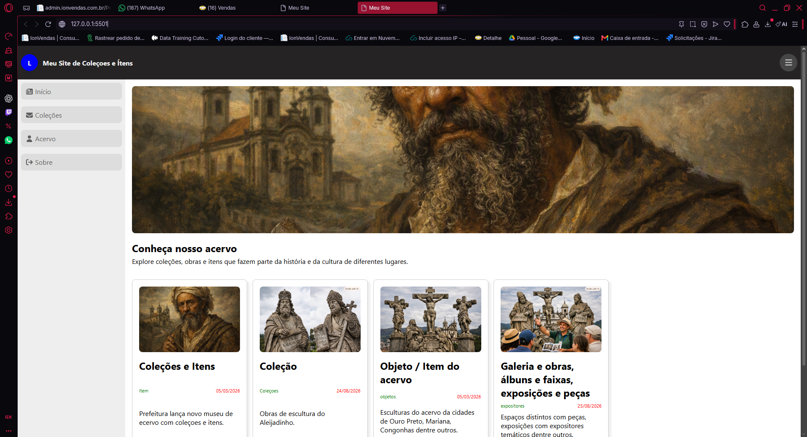
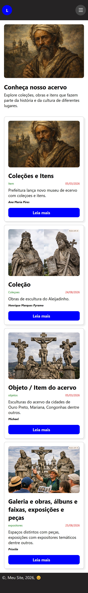

# Projeto Acervo DWFE 

## Sobre o prjeto

Projeto desenvolvido para as atividades prática da diciplina de Desenvolvimento web-front-end.

A proposta é apresentar um acervo de conteúdos utilizando HTML  e CSS, com uma página inicial adaptada para diferentes tamanhos de tela.

## Responsividade 

A página foi desenvolvida utilizando CSS puro, com flexbox, Grid e Media Queries para adaptar o conteúdo para dispositivos desktop e mobile.

## autor

Lucas Leite Silva 

## Versão Desktop

## Versão Mobile

